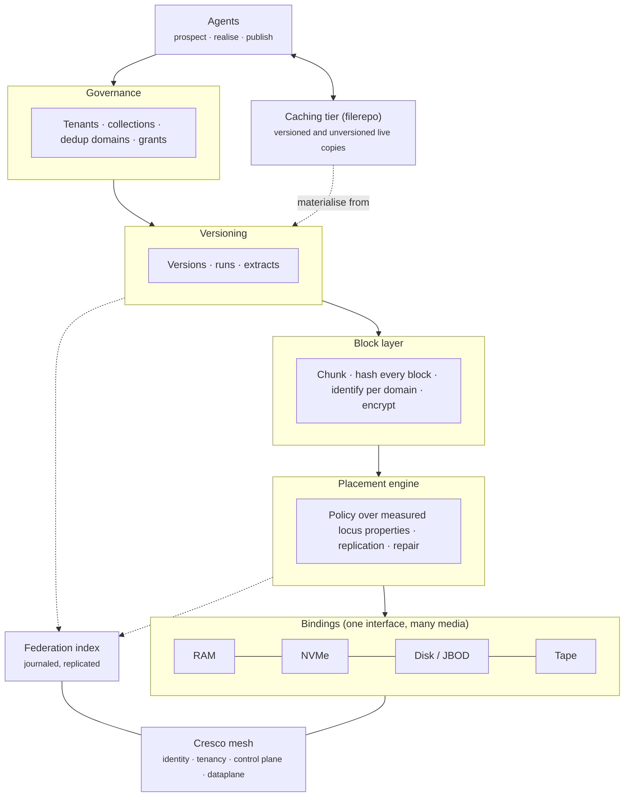

# Architecture

## The layers

| Layer | What it does | Status |
|---|---|---|
| Agent interface | `prospect` returns costed options for getting a version somewhere; `realise` is the only call that moves bytes; `publish` creates a version | **Designed** (Entail) |
| Governance | Tenants own collections; each collection carries compliance and deduplication policy; grants allow cross-collection and cross-tenant references | **Designed** (design of record 2026-09-23) |
| Versioning | Immutable versions built from runs; extracts as citable, pinnable point-in-time objects | **Designed** |
| Block layer | Split content into blocks, hash every block before storage, derive its identity and key according to the collection's domain | **Designed**; per-object counter discipline **Built** |
| Placement engine | Chooses where copies go using measured properties and policy; repairs lost copies | **Proven** in the prototype for erasure-coded placement; measured placement and fail-closed durability **Built** (reaches the live placement path) |
| Bindings | One interface every storage medium implements | Interface and filesystem binding **Built**; tape, raw NVMe, raw disk, RAM **Designed** |
| Federation index | Journaled log with a read-only replica; the catalogue of versions, placements and state | **Proven** (10⁶ files) |
| Caching tier | Live working copies materialised from versions; can publish new versions | Basic materialisation **Built** in filerepo; advanced tier **Designed**, scheduled after durable storage |
| Cresco mesh | Transport, identity, tenant isolation, QoS | **Proven** (Cresco 1.3) |

## Two paths through the system

**Writing a version.** An agent publishes changes to a collection. The block layer splits the new
content into blocks and hashes each one. The collection's policy decides whether a block with that
hash already exists in the collection's deduplication domain; if so, the new version only
references it. New blocks are encrypted and handed to the placement engine. The engine writes
copies to loci that satisfy the policy: for example, three sites, each able to show that its writes
reach durable storage. The version is committed once a quorum of the index confirms it.

**Reading a version.** An agent names a version (or an extract) and a destination. `prospect`
returns the options: stream it from the nearest copy, recall it from tape first, or send the
computation to where the data is. Each option comes with a cost interval and the constraint that
binds it. `realise` carries out the chosen option, verifying every block against its hash as it
streams. A live copy made at the destination is a cache of that version.

## What runs today versus the design of record

The running code is the September prototype. It implements an earlier shape of the design:
**erasure coding across sites** (Reed–Solomon over encrypted stripes), per-object data keys wrapped
under a site key, and placement onto blind storage nodes. That shape is proven; see
[The prototype](../built/prototype.md).

The design of record for phase one has moved since, by owner decision:

- **3-way replication across three sites** replaces cross-site erasure coding for now. Erasure
  coding returns later, reached by repacking the data. See [Durability](durability.md).
- **One placement engine across all media**, driven by measurement. See [Placement](placement.md).
- **Block-level deduplication under configurable policy.** See
  [Tenants, collections and deduplication](tenancy-and-dedup.md).

!!! warning "The binding interface is not yet on the live write path"
    `ExtentBinding`, the interface every medium implements, exists and is tested, but the live
    write path still calls the block store directly (`NodeAgent.putFragment → store.put`). Only
    commissioning goes through the binding today. Routing the live path through the interface is
    the first item of [phase 1](../roadmap/remaining.md). Nothing depends on it yet, so the change
    carries no migration cost.
