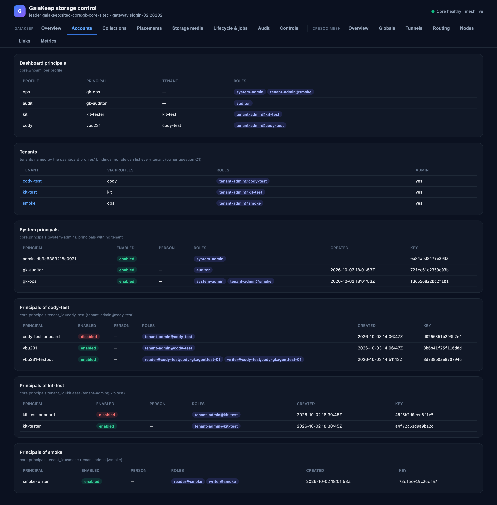

# Accounts

Who the dashboard is, who the principals are, and who the tenants are — from `core.whoami` per profile (every
10 min) and `core.principals` (every 60 s).

## Dashboard principals

One row per configured profile:

| Column | Meaning |
|---|---|
| Profile | The name the server was started with (`--gk-profile`). |
| Principal | The principal id the core answers `core.whoami` with. |
| Tenant | The profile's home tenant, if it has one. |
| Roles | The bindings the core lists — `system-admin`, `auditor`, `tenant-admin@t`, `reader@t[/c]`, `writer@t[/c]`. |

The bindings decide everything the dashboard can show: a datum is read with the first profile whose role the verb's
rule accepts, and a tenant appears on this page only because some profile is bound inside it. The page's note says
so: *tenants named by the dashboard profiles' bindings; no role can list every tenant* — whether an operator role
should be able to list every tenant is an open owner question (the design record's Q1).

## Tenants

The tenants at least one profile is bound in, via which profiles and roles, and whether the dashboard holds a
tenant-admin binding there (`Admin: yes`). Each tenant name links to its [Collections](collections.md) page.

## System principals

Principals with no tenant — the core's own service identities and operator accounts: principal id, whether
enabled, the owning person, roles, when created, and the **key fingerprint** (checked out of band when admitting
something). Read as system-admin. Roles the principal holds outside a tenant are folded into a `+N outside` count.

## Principals of a tenant

The same columns for one tenant's principals, read as that tenant's admin (`core.principals tenant_id=t`): who the
people are, what they may do inside the tenant, when their keys were created and what fingerprint they carry. A
paged list — more rows continue on the next page.

!!! note "What this page cannot show"
    Principals of a tenant the dashboard holds no binding in (the design record's Q5 asks whether system-admin,
    who can create and disable any principal, should also be able to list every tenant's). Today: no role can, so
    no page does.
