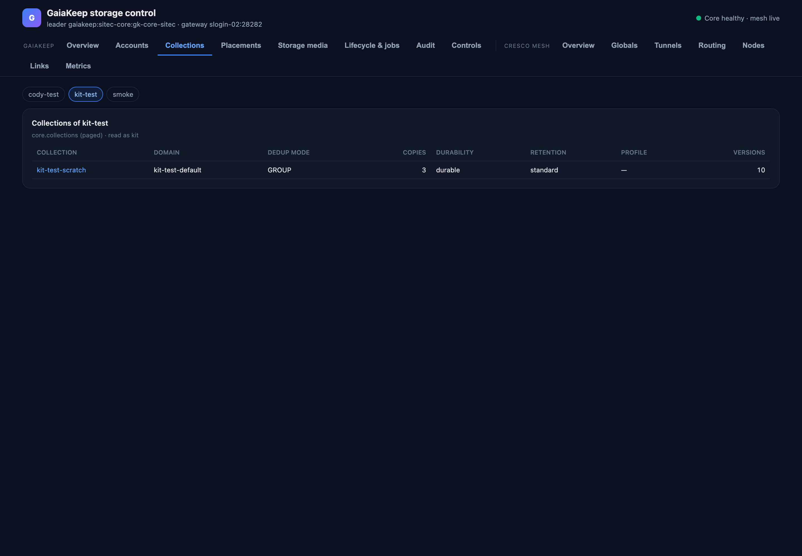
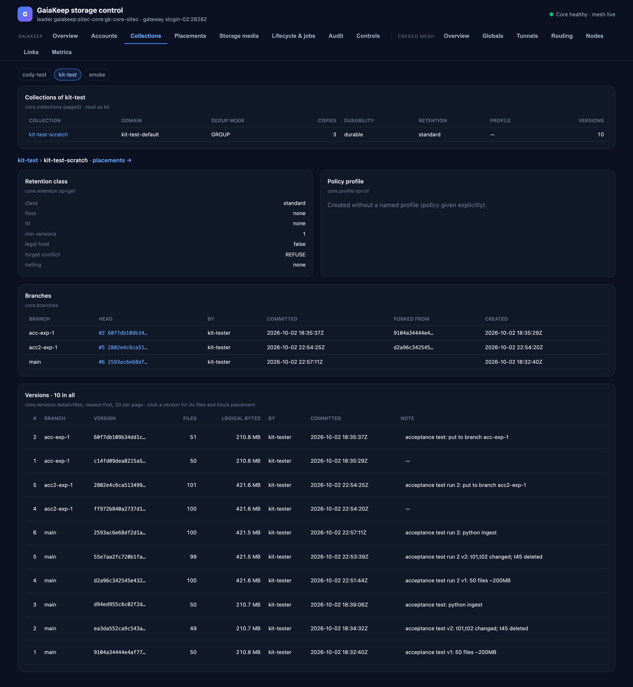

# Collections and versions

What collections exist, under what policies, and their version history — the tenant's view of the index.

## The tenant picker

One tab per tenant a dashboard profile is bound in. Everything below is read as that tenant's admin
(`core.collections tenant_id=t`, paged). The collection list shows:

| Column | Meaning |
|---|---|
| Collection | The collection's id — links to its detail below. |
| Domain | The dedup domain the collection was created in (deduplication is per domain; collections in one domain share blocks). |
| Dedup mode | `NONE`, `COLLECTION`, `GROUP` or `GLOBAL` — what may be deduplicated against what. |
| Copies | The replication factor the collection's policy requires. |
| Durability | The durability policy (for example the copy-count tolerance the collection is written with). |
| Retention | The retention class the collection holds (`standard`, `cache`, `scratch`, …). |
| Profile | The policy profile it was created under, if named. |
| Versions | How many versions the collection has. |

If the core does not answer `core.collections` (a build without it), the page says so and falls back to the
collections the dashboard's profiles name themselves — one row per profile default, with the policy columns dashed.

## The collection's detail page

Clicking a collection opens its full record:

- **Branches** — each branch with its head version id, who committed it and when, and the version it was forked
  from (`core.branches`, paged).
- **Versions** — the version history, newest first, twenty per page: the version number, its branch, its parent
  version, who committed it, when, the commit note, and the files and logical bytes it holds
  (`core.versions detail=files`, paged). The collection's total version count is shown with it.
- **Retention held now** — the retention class the collection currently holds, with its floor, TTL, minimum
  versions, legal hold and ceiling (`core.retention op=get collection_id=…`).
- **Profile** — the policy profile the collection was created under and what it specifies
  (`core.profile op=of`).

!!! note "Not shown here"
    Stored (physical, deduplicated) bytes per collection: the core does not maintain that counter yet — the
    design record's open item S-2, and owner question Q2 asks who may read it. Live and logical bytes system-wide
    are on [Overview](overview.md).
