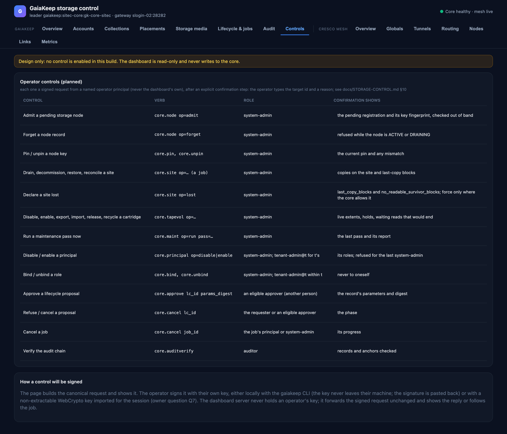

# Controls

**Design only — not built.** Nothing in the dashboard writes to the core. This page documents the controls the
dashboard is meant to grow, so the read-only slice can be judged against the whole design.

## How a control would work

Every control is one signed request from a **named operator principal** — never the dashboard's own observer
profiles — made in that operator's browser session:

1. The operator picks the action and target; the page shows the exact verb and parameters, and for anything that
   moves or forgets copies the `dry_run` answer first (copies affected, last-copy blocks).
2. An explicit confirmation: the operator types the target's id (site address, barcode, principal id, lifecycle id)
   and a reason, which the audit (and the record, where the verb takes one) keeps.
3. The request is signed with the operator's own key — either built canonically in the page and signed locally with
   the `gaiakeep` CLI, the signature pasted back, or signed in the browser with a non-extractable WebCrypto key per
   session. The dashboard server never holds operators' keys (owner question Q7 picks between the two).
4. The reply is shown; jobs are followed on [Lifecycle & jobs](lifecycle.md).

## The controls

| Control | Verb | Role | Confirmation shows |
|---|---|---|---|
| Admit a pending storage node | `core.node op=admit` | system-admin | the pending registration and its key fingerprint, checked out of band |
| Forget a node record | `core.node op=forget` | system-admin | refused while the node is ACTIVE or DRAINING |
| Pin / unpin a node key | `core.pin`, `core.unpin` | system-admin | the current pin and any mismatch |
| Drain, decommission, restore, reconcile a site | `core.site op=…` (a job) | system-admin | copies on the site, last-copy blocks |
| Declare a site lost | `core.site op=lost` | system-admin | last-copy and no-readable-survivor counts; force only where allowed |
| Disable / enable / export / import / release / recycle a cartridge | `core.tapevol op=…` | system-admin | live extents, holds, waiting reads that would end |
| Run a maintenance pass now | `core.maint op=run pass=` | system-admin | the last pass and its report |
| Disable / enable a principal | `core.principal op=…` | system-admin; tenant-admin@t for their tenant | the principal's roles; refused for the last system-admin |
| Bind / unbind a role | `core.bind`, `core.unbind` | system-admin; tenant-admin@t within their tenant | never to oneself |
| Approve a lifecycle proposal | `core.approve` | an eligible approver (another person) | the record's params and digest |
| Refuse / cancel a proposal | `core.cancel` | requester or eligible approver | the phase |
| Cancel a job | `core.cancel` | the job's principal or system-admin | progress |
| Verify the audit chain | `core.auditverify` | auditor | records, anchors |

## Deliberately not in the dashboard

Key rotation (`core.rotatemaster`), key-destruction proposals beyond the lifecycle record, legal orders, master-key
escrow, benchmarks and tuning: these stay CLI-only by design.
