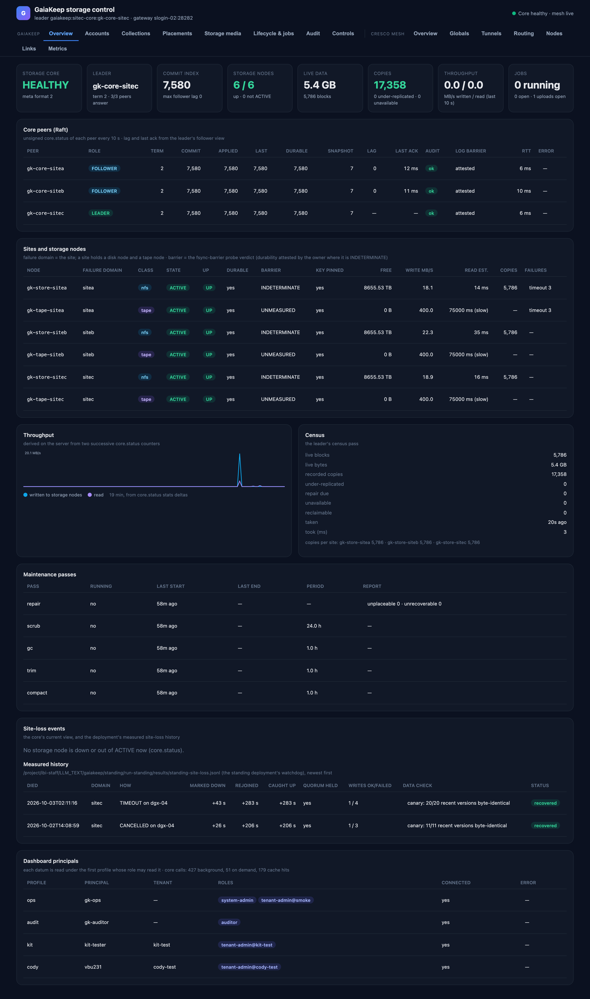

# The storage control dashboard

*2026-10-03. Documents the dashboard as it runs against the standing deployment; every screenshot is live data.*

The dashboard answers the owner's brief: *see your storage, where the data is and how it is working — down to
which block, which location and which tape type.* It is a **read-only** window onto a running GaiaKeep core and the
Cresco mesh underneath it. Agents remain the primary consumers of the storage; the dashboard is for people who need
to see what the agents' storage is doing.


<p class="gk-hero-caption">The Overview page — everything on it is explained in [Overview](overview.md).</p>

## The principles it is built on

| Principle | What it means on the screen |
|---|---|
| **Everything through signed core verbs** | Every datum comes from a named core verb answered under a named principal's role. The core's authorization and audit apply to the dashboard exactly as to any other client. Private keys never leave the dashboard server; the browser only ever sees JSON produced from verb replies. |
| **No new visibility** | The dashboard shows only what its configured principals may read. It never combines roles to reveal more than one of them could, and never asks for a role it lacks. Where nobody may read a datum, the page says so. |
| **Scale is a gate** | No page scans tenants, collections, versions, blocks, jobs or the audit log. Every list is one page of an index-backed verb, every drill-down is one page, every poll is bounded and cached on the server. The dashboard costs the core the same with 1 000 tenants as with 3. |
| **Degrade, never guess** | A datum the server could not get is shown as unavailable, with the verb and role that would supply it and the core's own reason. Numbers are the core's numbers, or rates derived from two of its own counters. Nothing is mocked. |

## Where it runs and how to open it

The dashboard serves on `127.0.0.1:28900` on a login node of the DGX cluster, run by a supervisor that restarts it
if it exits. It answers only loopback `Host` headers and sends no CORS header, so a hostile web page in your browser
cannot read tenant data through it — the only way in is an ssh tunnel:

```bash
ssh -N -L 28900:127.0.0.1:28900 <account>@<cluster login host>   # then open http://localhost:28900/
```

The browser never talks to the core: it talks to the dashboard server, which holds one signed client per operator
profile. Nothing on the site writes to the core — the Controls tab is a design only (see [Controls](controls.md)).

## The pages

| Page | What it answers | Reference |
|---|---|---|
| [Overview](overview.md) | Is the storage system healthy: peers, sites, throughput, census, maintenance, site loss | [Overview](overview.md) |
| [Accounts](accounts.md) | Who the dashboard is, who the principals are, who the tenants are | [Accounts](accounts.md) |
| [Collections](collections.md) | What collections exist, their policies, branches and versions | [Collections](collections.md) |
| [Placements](placements.md) | Where a file actually is: version → file → block → each copy's site and medium | [Placements](placements.md) |
| [Storage media](media.md) | The nodes and the media themselves: disk, pack and tape, down to drives and slots | [Storage media](media.md) |
| [Lifecycle & jobs](lifecycle.md) | Retention classes, policy profiles, forget/legal-order proposals, running jobs | [Lifecycle & jobs](lifecycle.md) |
| [Audit](audit.md) | The core's audit log: who did what, decided how, and why | [Audit](audit.md) |
| [Controls](controls.md) | The operator controls (design only, not built) | [Controls](controls.md) |
| [Cresco mesh](mesh.md) | The agents underneath: topology, tunnels, routing, node health | [Cresco mesh](mesh.md) |

## Who supplies what

The dashboard is configured with one profile per principal. A datum is fetched with the first profile whose bindings
the verb's rule accepts; a tenant's data appears only if a profile is bound inside it.

| Profile | Principal | Binding | Feeds |
|---|---|---|---|
| `ops` | `gk-ops` | system-admin, tenant-admin@smoke | node registry, cartridges and libraries, system principals, profiles, lifecycle list |
| `audit` | `gk-auditor` | auditor | the audit log, every principal's jobs, every tenant's lifecycle records |
| `kit` | `kit-tester` | tenant-admin@kit-test | kit-test's collections, versions, placements, principals |
| `cody` | the tenant owner's account | tenant-admin@cody-test | cody-test's collections, versions, placements, principals |

A principal that is deliberately *not* configured (a real user's) contributes nothing: the dashboard cannot read what
no configured role may read.

## Refresh, caching and the bound on core load

- **In the background**, independent of viewers: unsigned `core.status` of every core peer every 10 s, the node
  registry every 30 s, the lifecycle and job lists every 60 s, `core.whoami` per profile every 10 min. Throughput
  rates and a 30-minute history are computed on the server.
- **On demand** (a page asks): every reply is cached by verb, parameters and profile for the page's TTL
  (30–300 s); concurrent requests for the same datum share one call.
- **Rate limit**: on-demand calls are capped at 4 per second for the whole server; over budget is answered from
  cache, else the page retries.
- Every signed call is one audit record: about 4 records per minute in the background, whatever the number of
  viewers. No call's cost grows with the amount of data.

## When something is unavailable

A missing datum is rendered as a dashed box naming what is missing, the verb and role that would supply it, and the
core's own reason — for example `status 8: unknown core action …` on a core without the newer read verbs, or
`status 4: forbidden` when no configured profile holds the role. The page falls back to whatever else may supply the
view (the profile's own collection names, the built-in retention classes, the site census), so a gap degrades the
page instead of breaking it.
