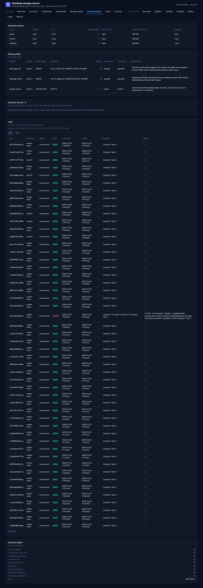

# Lifecycle & jobs

Retention policy, the proposals that change what is forgotten, and every job the core runs — the governance view.

## Retention classes

Every retention class the core knows, built-in and defined (`core.retention op=list`; on an older core the page
falls back to reading the built-in classes one by one):

| Column | Meaning |
|---|---|
| Class | The name collections hold (`standard`, `cache`, `scratch`, …). |
| Floor | The minimum age before anything in the class may be forgotten. |
| TTL | Time-to-live after last write (`none` for keep-forever classes). |
| Min versions | Versions of a collection in this class that are always kept. |
| Legal hold | Whether a legal hold pins everything in the class. |
| Forget conflict | What a forget does when a version is still referenced (`REFUSE`). |
| Ceiling | The maximum age after which a copy must not be kept. |

## Policy profiles

The named policy profiles — built-in, system-wide, and the tenant's own (`core.profile op=list`): scope, dedup
mode, chunker, copies, durability, retention, and a description. A collection created under a profile inherits all
of it.

## Lifecycle records

Forget, prune, legal order, retention override and key-destruction proposals, with their phases
(`core.lclist`, paged and scan-budgeted; the auditor reads every tenant's, a tenant-admin their own):

| Column | Meaning |
|---|---|
| Record | The lifecycle id (opens the full record: `core.lcstatus`). |
| Kind | What is proposed: forget, prune, legal order, retention override, destroy key. |
| Phase | Where it is: proposed → approved → running → done (or refused/cancelled). |
| Tenant / Requester / Created | Who and where. |
| Approvals | How many persons have approved. Approvals must be distinct people, bound by another person, older than the configured minimum age — the core enforces this; the dashboard shows it. |

An empty list means none has been proposed — the expected state of a healthy deployment.

## Jobs

Long-running work the core executes (repacks, repairs, archives, verifies), newest first
(`core.jobs`; any principal sees its own, the auditor sees everyone's — the page names which scope it read):

| Column | Meaning |
|---|---|
| Job / Principal / Verb | The job id, who started it, and the verb behind it. |
| State | Running, done, cancelled, failed. |
| Accepted / Ended | Timestamps. |
| Progress | The job's own progress report (for example files and bytes done). |
| Error | The failure message, if the job failed. |

The counters line above the list (running, open, retained, max, per principal) comes from `core.status`. Cancelling
a job is a control, not a dashboard feature ([Controls](controls.md)).

## Lifecycle engine

The engine's own counters from `core.status`: proposals by phase, approvals, and the guarantees the engine is
holding (cuts, pins, holds).
