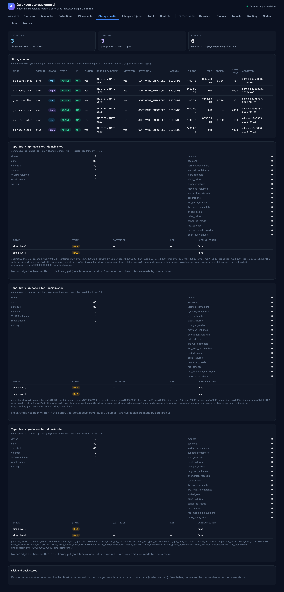

# Storage media

The nodes and the media themselves — disk, pack and tape, from the registry down to a library's drives and slots.

## The tiles

Disk nodes (count, total pledge, copies held), tape nodes (count and nominal capacity), and the registry records
this page shows, including how many nodes are waiting for admission.

## Storage nodes

One row per node, from the paged registry (`core.node op=list`, 500 per page, read as system-admin or auditor):

| Column | Meaning |
|---|---|
| Node / Domain / Class | Address; failure domain (the site); `nfs`, `tape` or `pack`. |
| State / Up | Registration state and reachability. |
| Pinned | Whether the node's key is pinned — a re-registration with a different key is refused. |
| Barrier evidence | The fsync-barrier probe verdict and its measured cost ratio (for example `INDETERMINATE ×1.37`). Where the hardware cannot be probed the durability is attested by the owner and the probe skipped — the attestation is recorded with the deployment. |
| Attested | Whether the node's durability attestation is on record. |
| Retention | How the node enforces retention (`SOFTWARE_ENFORCED`). |
| Latency | The node's latency class (`SECONDS` for tape, faster for disk). |
| Pledge / Free | Capacity pledged to the federation; what the node currently reports free (a tape node reports 0 — its capacity is its cartridges). |
| Copies | Live copies held. |
| Write MB/s | Measured write rate. |
| Admitted | Which system principal admitted the node and when. |

Nodes waiting for admission, and prototype-only nodes, are listed under the registry: admission is a control
([Controls](controls.md)), not something this read-only page does.

## Tape libraries

One card per archive site, read as system-admin (`core.tapevol op=status` for the cartridges, `op=library` for the
library's own state):

- **Cartridges** — barcode, state, admin state and reason (`DISABLED`, `EXPORTED`), whether reads are **held**,
  the cartridge's cohort, used bytes, live extents, whether it is reclaimable (and if not, why not), and which
  drive holds it. A cartridge with no live copy left goes back to the pool by relabelling from beginning-of-tape —
  never a WORM one.
- **Library state** — drives (state, loaded cartridge, LBP mode, whether the label was checked), slots total and
  full, volumes by state, WORM volumes, the recall (read) queue, cartridges being written, and the library's
  counters (mounts, sessions, verified containers, alerts, drive failures, recalibration events, …), plus the
  geometry and calibration line the simulator or drive reports.

An empty library is stated plainly: *no cartridge has been written in this library yet — archive copies are made by
`core.archive`*, which copies a collection's blocks to tape as extra copies and verifies them by reading back.

## Disk and pack stores

Per-container detail for the packed stores (containers and live fraction) is not served by the core yet — the
design record's open item S-4. Free bytes, copies and barrier evidence per node are in the registry above.
