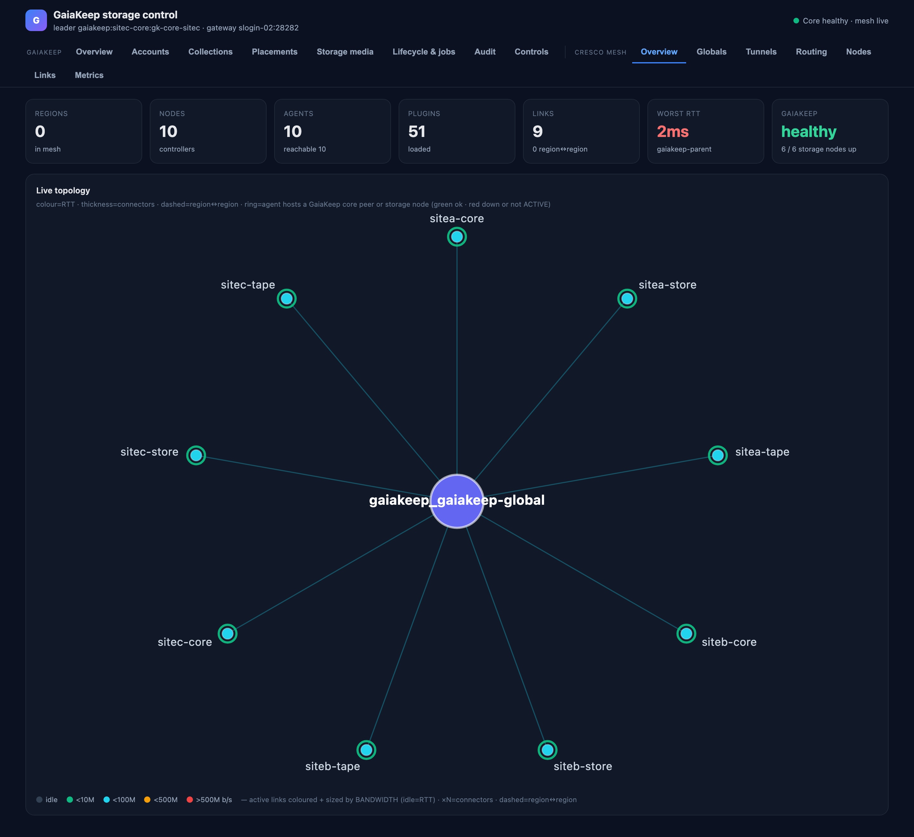

# The Cresco mesh tabs

The GaiaKeep storage pages sit beside the Cresco mesh tabs the dashboard has always had — the *"old information for
the underlying Cresco agents"*. The mesh is the fabric GaiaKeep runs on; these tabs show the fabric itself: where
the agents are, how they are connected, what the links are doing, and how the agent JVMs are feeling.

## Overview

The fabric at a glance — regions in the mesh, agents and how many are reachable, loaded plugins, region-to-region
links, the worst RTT — and the **live topology** graph of every agent. The GaiaKeep overlay is drawn on top: each
agent that hosts a GaiaKeep core peer, disk node or tape node is **ringed**, green when that node is up and
`ACTIVE`, red when it is down — the node state comes from the same `core.status` the storage pages read. Edges are
coloured and sized by measured bandwidth (idle edges by RTT), dashed edges are region-to-region, and `×N` marks
aggregated connectors.

## Globals

The region registry: each region, whether it is this dashboard's own or bridged, how many agents it holds, and the
bridged agents. Region globals (the attributes agents publish about themselves) with the global agent's view.

## Tunnels

Active stunnel tunnels traced end-to-end: total throughput across them and the traced hops. This page is a **push
stream** — the mesh pushes each tunnel's per-hop path and throughput as it runs, so a tunnel appears while it
carries traffic and the page subscribes rather than polls. No active tunnels is the quiet state, not a fault.

## Routing

The routing view built from the mesh's pushed link-state advertisements: each agent's routes to its peers, the
next hop and cost the fabric would use — the paths GaiaKeep's bulk bytes actually ride.

## Nodes

One row per agent: role in the mesh, environment, and the JVM's own health.

## Links

The mesh's links as the agents report them: endpoints, state, and the measured qualities behind the topology
edges.

## Metrics

Per-agent health metrics from the mesh's metric inventory. The column that matters for capacity reading:
**cores used is this JVM's own usage, not the host's** — a busy host with a quiet agent shows low cores-used next
to high host load. JVM heap, the host's load average and its CPU count sit alongside.

!!! note "Retired tabs"
    The old **Storage** and **Transfers** mesh tabs were removed: they were written for the gfs prototype's index
    RPC and beacon, which the storage core does not serve. The storage pages under *GaiaKeep* replace them.
