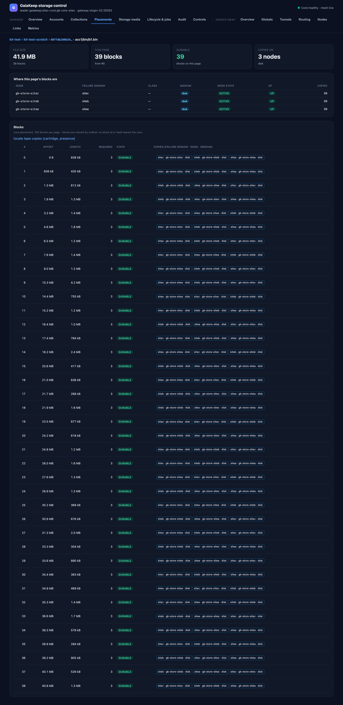
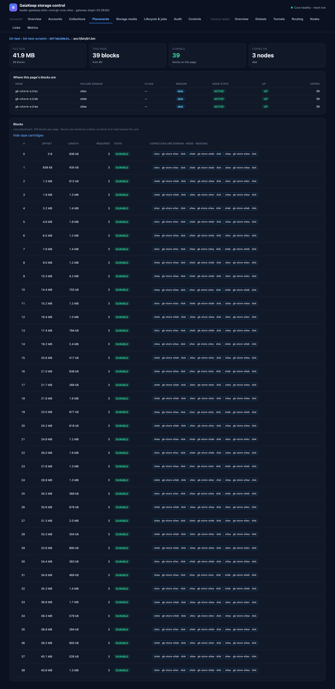

# Placements

Where a file actually is: the drill-down from a tenant to a collection, a version, a file, its blocks, and every
copy of every block — site, node and medium, down to the tape cartridge.

## The drill-down

Each level is one paged verb call; the census on the last level comes from the leader's status:

1. **Tenant** — the tenants a dashboard profile is bound in.
2. **Collection** — the tenant's collections with their copy counts (`core.collections`; the profiles' named
   collections as the fallback).
3. **Version** — the collection's versions: number, branch, who committed it, when, its files and logical bytes.
4. **File** — the version's files with size and block count (`core.list`, 100 per page).
5. **Blocks** — the file's blocks, 100 per page (`core.placement vid=… path=…`, paged).

## The file page

The tiles answer the four questions that matter: how big the file is, how many blocks it is cut into, how many of
those blocks on this page are `DURABLE`, and how many distinct nodes hold copies. *"Where this page's blocks are"*
groups the page's copies by node: failure domain, class, medium, node state, and the copy count on each.

## The blocks table

| Column | Meaning |
|---|---|
| # | The block's ordinal in the file. Blocks are deliberately **named by ordinal only** — no block id or hash ever leaves the core (the metadata-crypto rule that keeps sealed tenants' data unidentifiable). |
| Offset / Length | Where the block sits in the file and how many bytes it holds (the file's dedup domain cuts the file into variable-sized blocks). |
| Required | Copies the collection's policy requires. |
| State | `DURABLE` (the required copies are readable in independent failure domains), `UNDER_REPLICATED` (below required, repair scheduled) or `UNAVAILABLE` (no readable copy). |
| Copies | One chip per copy: **site · node · medium**, and for pack containers the container id. |

## Tape copies

`locate tape copies` adds one batched locate per archive site to the page, and each tape copy's chip gains the
cartridge **barcode**, the **presence** state (`verified` — read back and checked, `claimed` — the drive reported
it, `exported`, `absent`) and whether a **mount** is needed to read it:

!!! note "What placement does not show (yet)"
    Where on the cartridge the copy sits (file number and block): the design record's open item S-3. And a
    whole-version placement summary (copies per site for every block at once) would be a data-proportional job —
    open item S-8.
