[{ .gk-hero }](assets/gaiakeep-architecture.svg)
The target architecture. Erasure coding, tape as the counted primary tier and the caching tier are still being built: see [Status at a glance](built/status.md) for what runs today.

# GaiaKeep GFS

**A global file system built for agents, not people.** Its job is to keep versioned datasets
durable and to stream any version wherever it is needed: to a GPU node, a partner site, or an
agent's working cache. Data is stored as raw blocks on memory, NVMe, spinning disk or tape. The
medium does not change how callers use it.

> "The entire point of this system is to be ready to stream versioned datasets wherever they need
> to go. This once again is not for humans, it is for agents and to be used by agents."

The system is required to be five things:

| | What it means here |
|---|---|
| **Programmatic** | No filesystem and no human interface. Agents ask what something would cost, then ask for it. |
| **Versioned** | Every read names a version. Versions and point-in-time extracts are citable and reproducible. |
| **Resilient** | Copies in independent failure domains; loss is detected and repaired without intervention. |
| **Secure** | Encrypted at the origin; storage sites hold only ciphertext; policies scale from full isolation to global sharing. |
| **Distributed** | Runs over the [Cresco](https://crescoedge.github.io/quickstart/) mesh across institutions and sites. |

## Where things stand

**Release 1.3 shipped on 2026-10-01.** The durable storage core is built, tested and validated on
the DGX cluster. See [Release 1.3](built/release-1-3.md), [Test results](built/tests.md) and
[Benchmarks](built/benchmarks.md).

- **What is proven.**
    - **The 1.3 core:** 2,188 automated tests, green in CI. The secured live fabric check passes
      88/88 on the DGX.
    - **Ingest:** 8–16 GB at three copies runs at about 150 MB/s and reads back at about 290 MB/s,
      with no request over 20 s.
    - **Transport:** 0.7 GB/s per flow and over 2 GB/s across 4–8 flows.
    - **Format-aware dedup:** a de-identified DICOM re-upload sends under 1 % of its bytes.
    - **The prototype before it:** 99/99 functional checks, a 240-site federation and a million-file
      index. See [The prototype](built/prototype.md) and [Scale results](built/scale.md).
- **What is built and tested on simulated hardware.** The tape software path, on a simulator and on
  virtual drives. Pack containers on storage nodes. See [Status at a glance](built/status.md).
- **What is still to be decided and built.** Raw tape I/O on a real drive. Faster reads over links of
  80 ms and more. Erasure coding. The caching tier. See [Remaining work](roadmap/remaining.md) and
  [Open questions](roadmap/open-questions.md).

Every status claim on this site uses one of five labels:

| Label | Meaning |
|---|---|
| **Proven** | Built, and verified by executed tests or campaigns whose results are recorded. |
| **Built** | Implemented and unit-tested, but not yet on the live path or not yet run end to end. |
| **Designed** | Specified in the design record; not built. |
| **Proposed** | A mechanism has been proposed and is waiting on an owner decision. |
| **Open** | Not yet decided. |

## Reading order

1. [Purpose and principles](concepts/purpose.md): what the system is for and the rules that follow.
2. [Architecture](concepts/architecture.md): the layers and how a request moves through them.
3. [Status at a glance](built/status.md): one table of everything, with its label.
4. [Remaining work](roadmap/remaining.md): the phased plan.

## Source

- Code, harnesses and the full design record: `GaiaKeep/gfs` (private repository; the design record is mirrored here)
  (private, branch `1.3`; moved from CrescoEdge on 2026-09-23).
- This site: [`GaiaKeep/docs`](https://github.com/GaiaKeep/docs).
